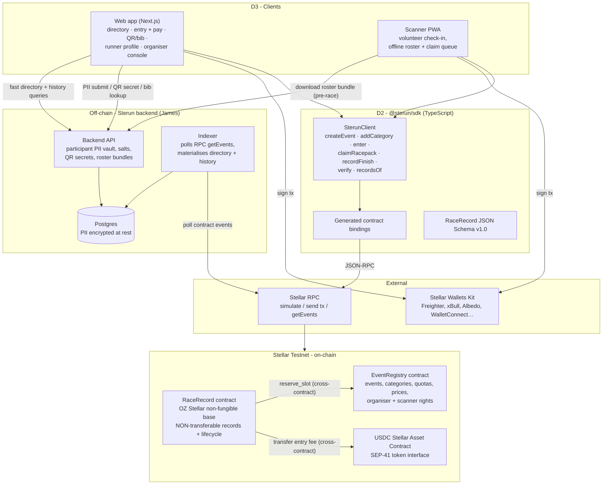
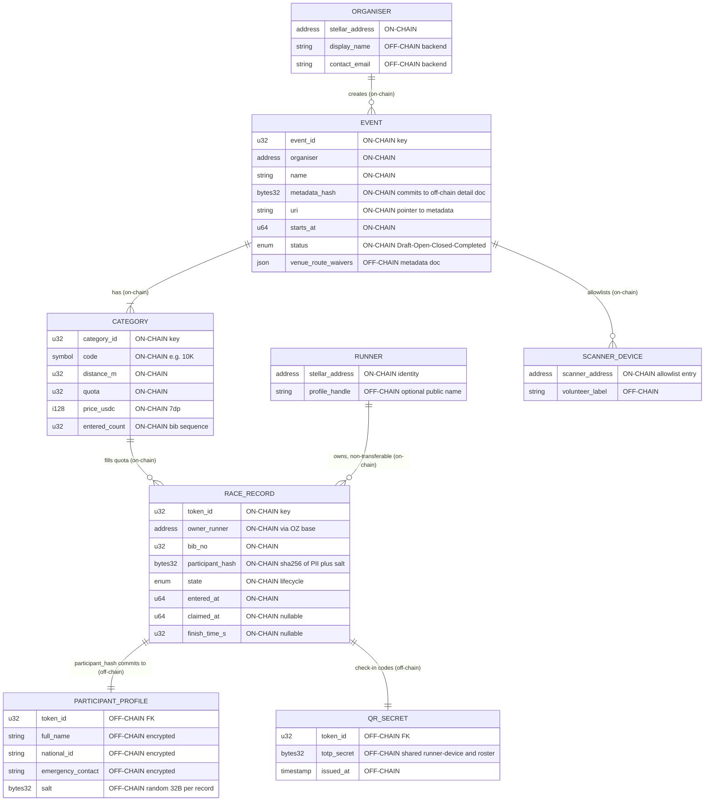
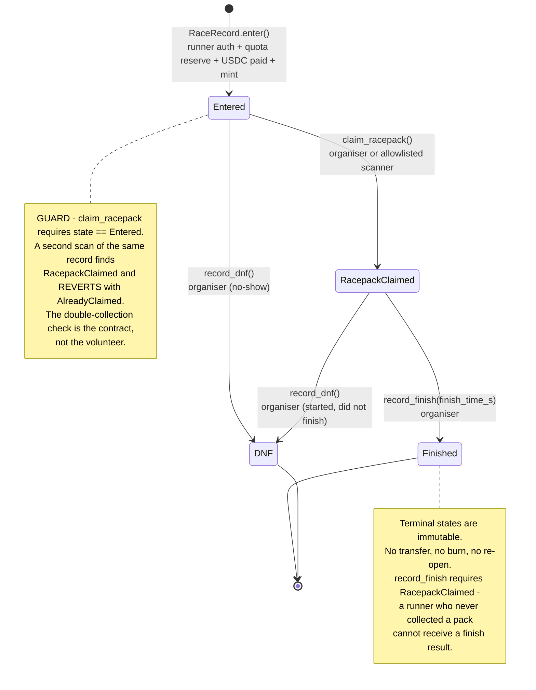
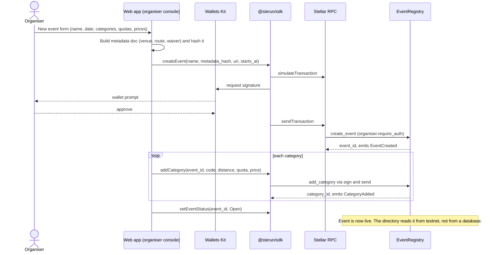
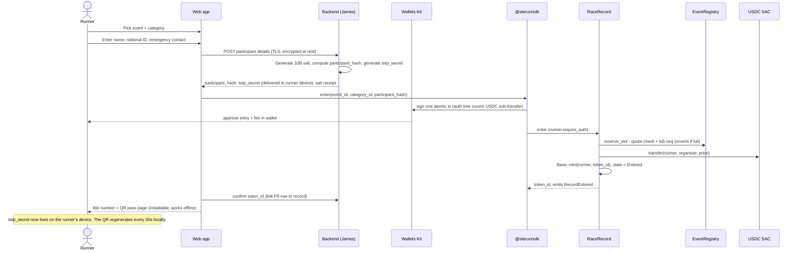
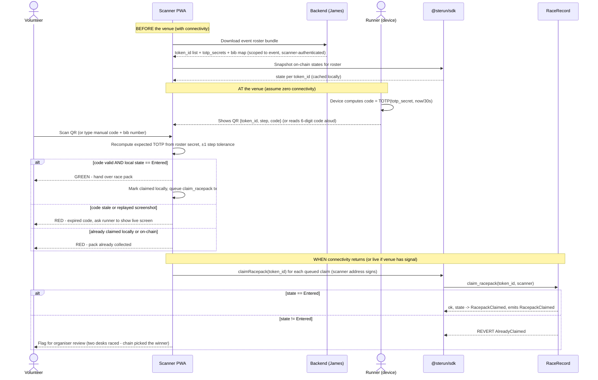
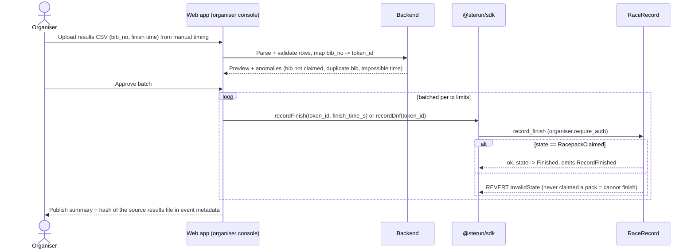
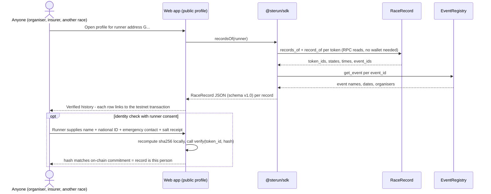
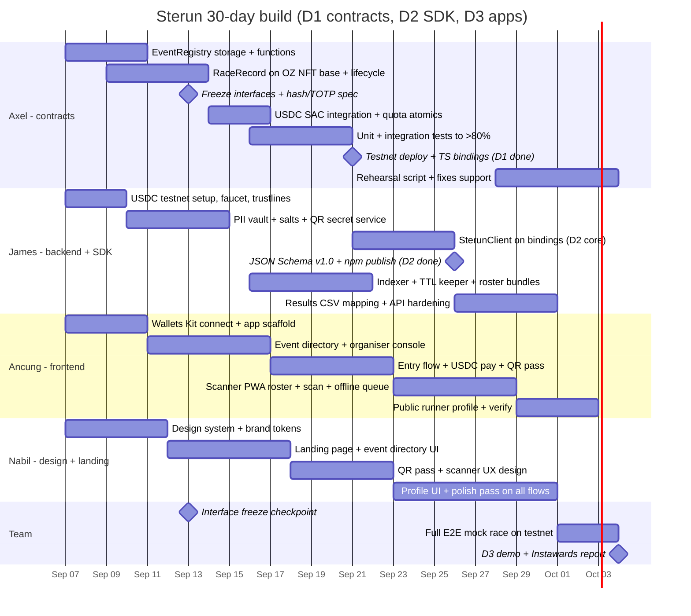

# STERUN - System Design

**Verified race records for running events on Stellar (Soroban).**
Design document v1.0 - diagrams and architecture only, no implementation code. Covers Instawards deliverables D1 (contracts), D2 (TypeScript SDK + schema), D3 (web app + race-day scanner PWA).

Team: **Ancung** (frontend), **Nabil** (frontend / landing / design), **James** (backend), **Axel** (smart contracts / AI).

---

## 1. Overview

Sterun is a race record protocol for running events, built on Stellar smart contracts (Soroban). Each race entry is issued as a non-transferable on-chain record bound to the runner who registered, so the organiser's participant list always matches the person actually on the course, which is what medical, emergency, and insurance handling depend on. The record moves through a fixed lifecycle (Entered, RacepackClaimed, Finished, or DNF), which makes a second race-pack collection impossible at the contract level and gives every runner a verifiable race history that is not locked inside one organiser's database. Personal data never touches the chain; only a salted hash links the record to the registered person.

---

## 2. System architecture

Three layers. On-chain holds the truth (entries, lifecycle, results, payment). Off-chain holds personal data and fast query indexes. Clients (web app, scanner PWA) talk to the chain through the typed SDK and to the backend for PII-adjacent flows.



Data-flow rules:

- **Chain is authoritative** for: entry existence, ownership, lifecycle state, quota, payment, result values, timestamps. The indexer is a cache, never a source of truth; the web app can always fall back to direct RPC reads.
- **Backend is authoritative** for: participant PII (name, national ID, emergency contact), per-record salts, per-record QR secrets. None of this ever goes on-chain; the chain stores only `participant_hash`.
- **Clients never talk to contracts raw**: everything goes through `@sterun/sdk` so organisers can integrate without writing Rust (the D2 promise).

---

## 3. Smart contract design (D1 - Axel)

Both contracts are Soroban Rust (`#![no_std]`, `wasm32v1-none` target, 128KB wasm limit), scaffolded per the Stellar dev build skill (workspace via `stellar contract init`, `__constructor` for one-time init, `#[contracttype]` key enums, `#[contracterror]` typed errors, `#[contractevent]` events). OpenZeppelin crates (`stellar-tokens`, `stellar-access`, `stellar-contract-utils`, `stellar-macros`) pinned with exact `=` versions in `[workspace.dependencies]`.

References:
- Contract dev fundamentals: https://developers.stellar.org/docs/build/smart-contracts (skill: `stellar-dev.smart-contracts`)
- OZ Stellar contracts (audited modules incl. Non-Fungible Token + extensions): https://developers.stellar.org/docs/tools/openzeppelin-contracts and https://github.com/OpenZeppelin/stellar-contracts
- Tokens example contracts: https://developers.stellar.org/docs/build/smart-contracts/example-contracts/tokens
- Storage type choice: https://developers.stellar.org/docs/build/guides/storage/choosing-the-right-storage
- Storage strategies (enumeration indexes): https://developers.stellar.org/docs/build/guides/storage/storage-strategies
- Authorization framework: https://developers.stellar.org/docs/learn/fundamentals/contract-development/authorization

### 3.1 EventRegistry

Purpose: the organiser-facing registry. One instance serves all events. Stores each event, its distance categories with per-category quota and price, and who may act for the event (organiser, scanner devices).

**Storage model**

| Key (`DataKey` enum) | Storage type | Value | Why this type |
|---|---|---|---|
| `Admin` | instance | `Address` | Tiny, global, read on most calls |
| `RaceRecordAddr` | instance | `Address` | Trusted caller for `reserve_slot` |
| `EventCount` | instance | `u32` | Monotonic event id counter |
| `Event(event_id)` | persistent | `EventData { organiser, name, metadata_hash, uri, starts_at, status }` | Long-lived, must survive archival cycles |
| `Category(event_id, category_id)` | persistent | `CategoryData { code, distance_m, quota, price_usdc, entered_count }` | Long-lived; `entered_count` doubles as bib sequence |
| `CategoryCount(event_id)` | persistent | `u32` | Enumerate categories per event |
| `Scanner(event_id, addr)` | persistent | `bool` | Per-event volunteer device allowlist |

**Key functions (design-level signatures)**

```text
__constructor(admin: Address)
set_race_record(race_record: Address)                      // admin, once wiring is final
create_event(organiser: Address, name: String,
             metadata_hash: BytesN<32>, uri: String,
             starts_at: u64) -> u32                        // organiser.require_auth()
add_category(event_id: u32, code: Symbol, distance_m: u32,
             quota: u32, price_usdc: i128) -> u32          // organiser only
set_event_status(event_id: u32, status: EventStatus)       // organiser only (Draft|Open|Closed|Completed)
add_scanner(event_id: u32, scanner: Address)               // organiser only
remove_scanner(event_id: u32, scanner: Address)            // organiser only
reserve_slot(event_id: u32, category_id: u32) -> u32       // ONLY RaceRecord contract; atomic quota check,
                                                           // increments entered_count, returns bib sequence
get_event(event_id: u32) -> EventData                      // view
get_category(event_id: u32, category_id: u32) -> CategoryData
get_organiser(event_id: u32) -> Address
is_scanner(event_id: u32, addr: Address) -> bool
event_count() -> u32
```

`reserve_slot` reverts with `QuotaFull` when `entered_count == quota`, and with `EventNotOpen` unless status is `Open`. Because the check and increment happen in one contract invocation, two simultaneous entries can never both take the last slot.

**Emitted events** (`#[contractevent]`, indexed fields as topics): `EventCreated{event_id, organiser}`, `CategoryAdded{event_id, category_id, quota, price}`, `EventStatusChanged{event_id, status}`, `ScannerAdded{event_id, scanner}`, `ScannerRemoved{event_id, scanner}`, `SlotReserved{event_id, category_id, seq}`.

**Authorization model**

- Organiser rights use the standard Soroban pattern: the stored `EventData.organiser` address must `require_auth()` for every mutating call on its event. No global roles needed beyond `Admin` (deploy/wiring only).
- `reserve_slot` is gated by invoker-contract authorization: the stored `RaceRecordAddr` must authorize, which a contract does implicitly when it is the direct cross-contract caller. No EOA can mint a slot without going through `RaceRecord.enter`.
- Custom accounts (`__check_auth`, CAP account abstraction) are deliberately **not** required in v1: organisers are plain addresses. The design stays compatible with organiser multisig or policy accounts later, because `require_auth` works identically for contract accounts implementing `CustomAccountInterface`. Refs: https://developers.stellar.org/docs/learn/fundamentals/contract-development/authorization#contract-account and https://developers.stellar.org/docs/build/guides/auth/check-auth-tutorials

### 3.2 RaceRecord

Purpose: issues one non-transferable record per entry, bound to the runner's address, carrying the lifecycle and the result. Built on the OpenZeppelin Stellar **Non-Fungible Token base** (`stellar-tokens::non_fungible::Base`) plus the **Enumerable** extension (needed for `records_of(runner)` on-chain enumeration; OZ implements it with forward + reverse indexes per the storage-strategies guide).

**Why non-transferable means NO transfer function, not a blocked one**

A Soroban contract exposes exactly the functions in its `#[contractimpl]` export surface. There is no fallback dispatch, no `delegatecall`, and host-blocked reentrancy. The OZ NFT base splits *storage primitives* (`Base::mint`, `Base::owner_of`, `Base::balance`, `Base::token_uri`) from the public `NonFungibleToken` trait that would export `transfer` / `transfer_from` / `approve`. RaceRecord uses only the storage primitives and defines its own public surface, which simply does not contain any transfer or approval entry point. Ownership can therefore never change after mint: not because a guard says "revert if transfer", but because no exported code path writes to the owner mapping. A gate can be misconfigured or upgraded away; an absent function cannot be called. (Burn is also absent: a race history is append-only; see Risks for the privacy trade-off.)

**Storage model**

| Key | Storage type | Value | Notes |
|---|---|---|---|
| `Admin`, `RegistryAddr`, `UsdcAddr` | instance | `Address` | Wiring set in `__constructor` |
| OZ base: owner, balance, enumeration indexes | persistent | managed by `stellar-tokens` | Never mutated outside mint |
| `Record(token_id)` | persistent | `RecordData` (below) | The verifiable record itself |

```text
RecordData {
  event_id: u32, category_id: u32,
  bib_no: u32,                       // category seq from reserve_slot
  participant_hash: BytesN<32>,      // sha256(name || national_id || emergency_contact || salt)
  state: RecordState,                // Entered | RacepackClaimed | Finished | Dnf
  entered_at: u64, claimed_at: Option<u64>,
  finish_time_s: Option<u32>, result_at: Option<u64>
}
```

**Key functions (design-level signatures)**

```text
__constructor(admin: Address, registry: Address, usdc: Address,
              name: String, symbol: String, base_uri: String)

enter(runner: Address, event_id: u32, category_id: u32,
      participant_hash: BytesN<32>) -> u32
      // runner.require_auth(); registry.reserve_slot() cross-call;
      // usdc.transfer(runner, organiser, price) cross-call (SEP-41);
      // Base::mint(runner, token_id); store RecordData{state: Entered}

claim_racepack(token_id: u32, operator: Address)
      // operator.require_auth(); operator must be organiser or is_scanner();
      // GUARD: state == Entered, else Error::AlreadyClaimed (revert);
      // state -> RacepackClaimed, claimed_at = ledger time

record_finish(token_id: u32, finish_time_s: u32)
      // organiser only; GUARD: state == RacepackClaimed;
      // state -> Finished (terminal)

record_dnf(token_id: u32)
      // organiser only; from Entered or RacepackClaimed; terminal

extend_record_ttl(token_id: u32)                            // permissionless rent top-up
record_of(token_id: u32) -> RecordData                      // view
records_of(runner: Address) -> Vec<u32>                     // view (Enumerable)
verify(token_id: u32, participant_hash: BytesN<32>) -> bool // view: hash + owner match
owner_of(token_id) / balance(owner) / token_uri(token_id)   // OZ base views
```

The single USDC `enter` transaction is atomic: quota reservation, payment, and mint all succeed or all revert. The runner signs one auth tree that covers the nested SAC `transfer` sub-invocation (Soroban authorization framework).

**Emitted events**: `RecordEntered{runner*, event_id*, token_id, bib_no}`, `RacepackClaimed{token_id*, event_id*, operator}`, `RecordFinished{token_id*, event_id*, finish_time_s}`, `RecordDnf{token_id*, event_id*}` (`*` = topic, so the indexer and profile pages can filter by runner or event via RPC `getEvents`).

**Authorization model**: runner authorizes `enter` (and the fee transfer inside it); organiser authorizes results; organiser-allowlisted scanner addresses authorize `claim_racepack`. All via `Address::require_auth()`; no custom `__check_auth` in v1 (noted as a later path for kiosk/policy accounts).

### 3.3 Payments - USDC via the Stellar Asset Contract (SEP-41)

Entry fees are testnet USDC, a classic Stellar asset exposed to contracts through its **Stellar Asset Contract**, which implements the **SEP-41 token interface** (CAP-46-6). RaceRecord holds the SAC address and calls `transfer(runner, organiser, price)` cross-contract; runners need a USDC trustline (classic) funded from a testnet faucet/friendbot flow.

- Token interface (SEP-41): https://developers.stellar.org/docs/tokens/token-interface
- SAC overview: https://developers.stellar.org/docs/tokens/stellar-asset-contract
- Integrating SAC from contracts: https://developers.stellar.org/docs/build/guides/tokens/stellar-asset-contract
- Deploying a SAC for an asset (CLI): https://developers.stellar.org/docs/tools/cli/cookbook/deploy-stellar-asset-contract

Design choice: fees go **directly runner → organiser** in the entry transaction. No escrow contract in v1 (refund policy is an open question, Section 11). Prices are `i128` in the token's 7-decimal representation.

### 3.4 Storage TTL and state archival strategy

Soroban storage is rented: persistent entries have a TTL and get **archived** (not deleted) when it lapses; they must then be restored with `RestoreFootprintOp` before use. Race records are exactly the kind of long-lived state this threatens, so it is designed for explicitly:

1. All event/category/record entries are **persistent** (survive archival, restorable), never temporary.
2. Every mutating function extends the touched entries' TTL (threshold/extend-to pattern, e.g. extend to ~180 days when below ~120).
3. `extend_record_ttl` is public and permissionless so anyone (runner, organiser, Sterun cron) can pay rent on a record.
4. James's backend runs a **TTL keeper job**: weekly scan of tracked entries via RPC, batch `ExtendFootprintTTLOp` from the JS SDK, and a documented restore runbook if anything ever archives anyway.

Refs: https://developers.stellar.org/docs/learn/fundamentals/contract-development/storage/state-archival · https://developers.stellar.org/docs/build/guides/archival/extend-persistent-entry-js · https://developers.stellar.org/docs/build/guides/dapps/state-archival · https://developers.stellar.org/docs/build/guides/archival/test-ttl-extension

### 3.5 Testing (>80% target)

Per the stellar-dev skill testing guidance: unit tests per function with `testutils` (mock auths, ledger time control), integration tests wiring EventRegistry + RaceRecord + a test SAC token, lifecycle-guard tests (double claim reverts, finish before claim reverts, transfer absence asserted via the contract spec having no such export), quota race tests, TTL extension tests, and event-emission assertions. Coverage measured with `cargo llvm-cov`.

---

## 4. Data model

On-chain entities carry only identifiers, hashes, money, and lifecycle. Everything personally identifying lives off-chain in James's PII vault, linked by `token_id`.



`participant_hash = sha256(name || national_id || emergency_contact || salt)` is a **commitment**, not encryption: given the off-chain plaintext plus salt, anyone (insurer, medical desk, auditor) can recompute and match it against the chain; without the salt, the low-entropy national ID cannot be brute-forced out of the hash. The salt is 32 random bytes generated per record, held by the backend and shown once to the runner.

---

## 5. Record lifecycle



| Transition | Function | Authorized by | Guard |
|---|---|---|---|
| mint → `Entered` | `enter` | runner | event `Open`, quota not full, USDC paid |
| `Entered` → `RacepackClaimed` | `claim_racepack` | organiser / scanner | `state == Entered` else revert |
| `RacepackClaimed` → `Finished` | `record_finish` | organiser | `state == RacepackClaimed` |
| `Entered`/`RacepackClaimed` → `DNF` | `record_dnf` | organiser | non-terminal state |

---

## 6. User flows

### 6a. Organiser creates an event with categories



### 6b. Runner enters, pays USDC, receives bib + QR



### 6c. Race day: volunteer scans QR → claim_racepack (rotating code + offline fallback)



### 6d. Organiser records finishes



### 6e. Anyone verifies a runner's history



---

## 7. Rotating QR / anti-fraud design

**Goal**: at a check-in desk with no connectivity, a volunteer must be able to tell (1) this phone belongs to the registered entry, and (2) this entry has not collected a pack yet, in under two seconds.

**Mechanism** (TOTP applied to race check-in):

1. At entry time the backend generates a per-record random secret (`totp_secret`, 32B). It is delivered once to the runner's device (stored in the QR pass PWA) and kept server-side for roster bundles. It is never on-chain.
2. The runner's device computes `code = HMAC-SHA256(totp_secret, floor(unix_time / 30))`, truncated to 6-8 digits, entirely offline. The QR payload is `{token_id, time_step, code}` plus the same code printed as digits for the manual fallback.
3. The scanner PWA pre-downloaded the event roster (token_id → secret, bib, name-fragment) while online. Verification is a local HMAC recompute with ±1 step clock tolerance. No venue connectivity needed on either side.
4. The scanner marks the record claimed locally at once, and queues the real `claim_racepack` transaction for submission when connectivity returns.

**Why a forwarded screenshot fails**: the screenshot freezes one 30-second code. By the time it is forwarded in a chat group and presented, the time step has moved and the HMAC no longer matches. An attacker would need the `totp_secret` itself, which never appears in the QR, only its per-step output does.

**Why double collection reverts on-chain**: the local roster check stops same-desk repeats instantly, but the contract is the arbiter. `claim_racepack` reads `Record(token_id).state` and reverts with `AlreadyClaimed` unless it is exactly `Entered`. Two desks scanning the same record while offline will both queue a claim; the chain accepts exactly one and the second desk gets a flagged revert to reconcile. The invariant "one pack per entry" is enforced by consensus, not by volunteer discipline.

**Layered defence summary**

| Layer | Stops | Enforced by |
|---|---|---|
| Non-transferable record | Bib resale changing who the record points to | No transfer export in RaceRecord |
| `participant_hash` | Impersonation of the registered person | sha256 commitment vs off-chain PII + salt |
| 30s TOTP QR | Forwarded screenshots, replay | HMAC on runner device + roster on scanner |
| `state == Entered` guard | Double race-pack collection | RaceRecord contract, reverts |
| Scanner allowlist | Rogue devices claiming records | EventRegistry `is_scanner` + `require_auth` |

Residual risk stated honestly: someone can still physically hand their phone plus their race pack to a friend. Sterun makes the *record* truthful (the chain still says who registered, and the organiser can spot-check identity against the hash); it does not put marshals on the course. See Section 11.

---

## 8. Tech stack

| Layer | Technology | Owner |
|---|---|---|
| Smart contracts | Rust + soroban-sdk, `wasm32v1-none`, Stellar CLI (init/build/deploy/invoke) | Axel |
| NFT base | OpenZeppelin `stellar-tokens` non_fungible Base + Enumerable, `stellar-macros` guards | Axel |
| Payments | USDC via Stellar Asset Contract, SEP-41 token interface, testnet | Axel (contract side), James (faucet/trustline helper) |
| Contract tests | soroban-sdk testutils, cargo llvm-cov (>80%) | Axel |
| SDK (D2) | TypeScript, `stellar contract bindings typescript` output + `SterunClient`, zod-validated RaceRecord JSON Schema v1.0, npm publish | James (client + schema), Axel (bindings + contract spec) |
| Backend | Node.js/TypeScript API, Postgres (PII encrypted at rest), RPC `getEvents` indexer, TTL keeper job, roster bundle service | James |
| Web app | Next.js + Tailwind, `@stellar/stellar-sdk`, Stellar Wallets Kit (Freighter, xBull, Albedo, WalletConnect, Ledger) | Ancung (flows), Nabil (design system, landing, directory UI) |
| QR pass | In-web installable pass page, local TOTP, works offline | Ancung |
| Scanner PWA | PWA (service worker, offline roster + tx queue), camera scan + manual code entry | Ancung |
| External infra | Stellar RPC (testnet), Friendbot, testnet USDC issuer | James |
| Design / brand | Landing page, design system, QR pass and scanner UX | Nabil |

Wallets Kit reference: https://developers.stellar.org/docs/tools/developer-tools/wallets#stellar-wallet-kit. Passkey smart accounts (secp256r1 since Protocol 21, `__check_auth` WebAuthn wallets) are noted as a future onboarding path for runners without extensions, but only Wallets Kit is in scope: https://developers.stellar.org/docs/build/guides/contract-accounts/smart-wallets#passkeys

---

## 9. Component breakdown by owner

| # | Component | Deliverable | Owner | Depends on / hands off to |
|---|---|---|---|---|
| C1 | EventRegistry contract (storage, functions, events, tests) | D1 | Axel | → C3 bindings, → C8 indexer event shapes |
| C2 | RaceRecord contract (OZ NFT base, lifecycle, guards, tests) | D1 | Axel | C1 (`reserve_slot`), USDC SAC address ← James |
| C3 | Testnet deployment + addresses + generated TS bindings | D1/D2 | Axel | → James (SDK), → Ancung (apps) |
| C4 | `participant_hash` + TOTP code spec (hashing, salt, step, tolerance) | D1/D3 | Axel | → James (backend impl), → Ancung (pass + scanner impl) |
| C5 | `SterunClient` (createEvent, addCategory, enter, claimRacepack, recordFinish, verify, recordsOf) | D2 | James | C3 bindings; → Ancung/Nabil consume |
| C6 | RaceRecord JSON Schema v1.0 + npm packaging + SDK docs | D2 | James | reviewed by Axel |
| C7 | Backend API: PII vault, salts, QR secrets, roster bundles, results CSV mapping | D3 | James | C4 spec; → Ancung (API contract) |
| C8 | Indexer (RPC getEvents → Postgres) + TTL keeper job | D3 | James | C1/C2 event shapes from Axel |
| C9 | Event directory + public runner profile (live testnet reads) | D3 | Ancung (logic) + Nabil (UI) | C5 SDK, C7 API |
| C10 | Entry flow: category pick, PII form, Wallets Kit connect, USDC pay, bib + QR pass | D3 | Ancung | C5, C7; UX ← Nabil |
| C11 | Scanner PWA: roster sync, camera scan, TOTP verify, offline claim queue, manual fallback | D3 | Ancung | C4, C5, C7 roster format |
| C12 | Organiser console: create event, categories, scanners, results upload | D3 | Ancung | C5, C7 |
| C13 | Landing page, design system, QR pass + scanner visual design | D3 | Nabil | → Ancung |
| C14 | E2E rehearsal: scripted mock race on testnet (enter → scan → finish → verify) | all | Axel (script) + all | C1-C13 |

**Handoff contracts (freeze early, in this order):**

1. **Contract interface + event shapes** (Axel → James, Ancung): function signatures and `#[contractevent]` layouts frozen end of week 1; bindings regenerate on any change.
2. **Hash + TOTP spec** (Axel → James, Ancung): byte-exact definition of `participant_hash` and code derivation, week 1, so backend and both PWAs compute identical values.
3. **Backend API + roster bundle format** (James → Ancung): OpenAPI doc, week 2.
4. **Design system** (Nabil → Ancung): tokens + component kit, week 2.
5. **RaceRecord JSON Schema v1.0** (James ↔ Axel): the public verification format every profile page and third party consumes, week 3.

---

## 10. 30-day plan

Weeks map to deliverables: W1-W2 mostly D1, W2-W3 D2, W2-W4 D3, W4 integration + rehearsal. One section per owner as a swimlane.



---

## 11. Risks and open questions

1. **TTL / state archival of long-lived records.** A runner's history must outlive the event by years, but persistent entries archive when rent lapses. Mitigated by design (Section 3.4: extend-on-write, permissionless `extend_record_ttl`, keeper job, restore runbook), but the economics of who pays rent long-term (runner? organiser? protocol fee?) is unresolved.
2. **National ID hashing and privacy.** The hash is a commitment; safety depends entirely on the salt staying secret and random, because national IDs are low entropy. Backend compromise leaks PII (it is a normal Web2 database with normal Web2 obligations). Also unresolved: right-to-erasure vs an immutable on-chain hash (the hash alone identifies nobody, but the legal reading in our jurisdiction needs checking before mainnet).
3. **Backend holds QR secrets.** Check-in integrity partially trusts James's roster service: a leaked roster lets an attacker mint valid codes. Damage is capped by the on-chain guard (still only one pack per record, and only via allowlisted scanner addresses). A future version can replace shared secrets with wallet-signature-derived codes at the cost of check-in UX.
4. **Results are only as honest as the organiser.** No timing hardware in this phase; `record_finish` values come from manual timing uploads. The chain makes results tamper-evident after publication, not correct at the source. Mitigation: anomaly checks on upload and publishing the source-file hash. Timing-mat integration is explicitly out of scope.
5. **Fiat on-ramp out of scope.** Entry is testnet USDC only. Real events need SEP-24 anchor deposits or organiser-side fiat collection with on-chain issuance; deferred, and it changes the payment flow shape (someone else pays for the runner).
6. **Refunds and cancellations undefined.** Fees flow directly runner → organiser with no escrow, so a cancelled race depends on the organiser refunding off-protocol. An escrow variant of `enter` is a known v2 design.
7. **Wallet UX for non-crypto runners.** Requiring Freighter and a USDC trustline will lose casual runners. Passkey smart accounts (secp256r1 + `__check_auth`) are the documented path, deliberately out of scope now; Wallets Kit only.
8. **Offline claim queue conflicts.** Two offline desks can both approve the same runner; the chain resolves it later, meaning one pack may already be physically handed over before the revert is seen. Procedure mitigation: split roster ranges per desk; the flagged-revert list goes to the organiser same-day.
9. **Physical impersonation remains possible.** A runner can hand phone + pack to a friend. Sterun guarantees record integrity and gives organisers a hash to verify identity against; it cannot enforce who is physically running. State this honestly in organiser materials.
10. **RPC event retention.** Testnet RPC keeps a limited `getEvents` window, so the indexer (not RPC) is the long-horizon query layer; if the indexer is ever rebuilt, it must replay from history or contract state, which the design allows since state, not events, is authoritative.
11. **Clock skew at check-in.** TOTP tolerates ±1 step (90s window). A device with a badly wrong clock fails valid scans; the manual-code fallback plus a scanner-side "clock sanity" banner covers it.
12. **Contract upgradeability.** v1 deploys non-upgradeable for record immutability. If a bug forces redeploy on testnet, records migrate via a scripted re-issue. Whether mainnet v2 uses OZ `Upgradeable` (with what governance) is open.

---

*Grounded in: OpenZeppelin Stellar contracts (non-fungible base + extensions), SEP-41 / Stellar Asset Contract for USDC, Soroban storage + state archival, the Soroban authorization framework, Stellar Wallets Kit, and the stellar-dev smart-contracts build skill. Canonical URLs inline in Sections 3 and 8.*
